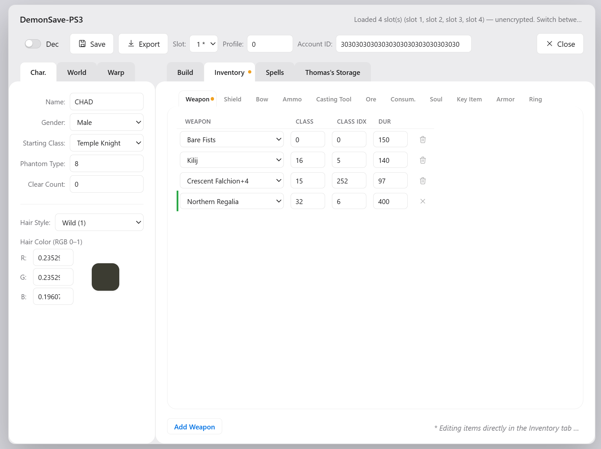

# DemonSave-PS3

*A write-up from Aug 1, 2026.*

A no-server, no-install save editor for Demon's Souls on PS3. Drop in your
save folder and it decrypts, parses, and lets you edit characters, inventory,
equipment, spells, and the item deposit — then re-encrypts and rehashes
everything so the save still loads on real hardware. It runs entirely in the
browser, or as a native desktop app via Tauri, with no backend and no native
dependencies.

That's the *what*. The *why* is a little more fun.

---

## Why build this?

Two reasons, tangled together.

The first is a game. Demon's Souls is a genuinely great game with genuinely
great memories attached — and an old, persistent debate: is the PS5 Remake
actually *better* than the original, or just prettier? I wanted to settle that
for myself without re-living the parts nobody misses. Nobody fondly recalls
farming for a rare Pure Bladestone drop until their soul gives out. A save
editor sidesteps the grind and lets you actually play the comparison.

The second is curiosity. I'd used AI plenty — but always in pieces, never to carry
a whole project, first sketch to last test, through all the redesigns and
rewrites in between. This time I wanted to hand it the entire arc and see how
far it actually goes. And I wanted to put a specific model through its paces:
GLM 5.2, which people keep saying is good.

> **Two goals, one project: revisit Boletaria — and build a product from
> scratch with an AI.**

---

## Why plain JavaScript (and not a bit of TypeScript)?

Short answer: I wanted zero distance between the source and the thing the
browser actually runs. This project loads straight from the repo via ES
modules — no bundler, no compiler, no "trust me, the build matches the code."
For software that does byte-exact crypto on your save data, debugging the file
you can read beats debugging a transpiled impression of it. TypeScript doesn't
forbid that model, but it ends the no-build property that makes it work.

Type safety didn't vanish, though — there's a type checker in the lint step
catching the obvious lies, just lighter than full `strict` TypeScript. So the
safety net didn't disappear; it got thinner. I won't pretend JSDoc is as
pleasant as an `interface`, because it isn't. That verbosity is the tax.

Honest coda: if the project grew much bigger or a second contributor showed
up, I'd probably reach for TypeScript. At this size, for one person, the
no-build simplicity was worth the tax.

> **The source file is the running file. That one property is the whole reason
> this is plain JavaScript.**

---

## How it came together

Nothing here was built from nothing. This project stands on a decade of
community reverse-engineering, and it's only right to name them:

- **Save-format knowledge** — [Wulf2k/DeS-SaveEdit](https://github.com/Wulf2k/DeS-SaveEdit),
  [BuXXe/PARAM.PFD-PS3-Demons-Souls-Savegame-Tool](https://github.com/BuXXe/PARAM.PFD-PS3-Demons-Souls-Savegame-Tool),
  [bucanero/apollo-ps3](https://github.com/bucanero/apollo-ps3), and the
  [PS3 Dev Wiki](https://www.psdevwiki.com/ps3/).
- **Game knowledge** — [demonssouls.wikidot.com](http://demonssouls.wikidot.com/),
  [wiki.fextralife.com](https://wiki.fextralife.com), and
  [rpcs3.net](https://rpcs3.net/).

From there, the work split into two halves.

**The AI half** did a lot of the heavy lifting: research, reverse engineering,
summarizing raw docs into something usable, implementation, tooling, and more
than a little design help. If you can think it, the model probably drafted it
first.

**The human half** is where the actual engineering lived. Architecture and
redesign. UX decisions. Instructed refactors. Performance work. The slow,
unglamorous hardening. And the discipline — unit tests, lint, documentation —
that turns a prototype into something you'd trust with your save data.

> **Put bluntly: the AI did the typing. I did the herding.**

---

## What I actually learned

Some takeaways, in case you're weighing the same tools.

**On GLM 5.2 specifically.** It's proficient — genuinely. I can't say how it
compares to Fable 5 or k3, since I didn't run those head-to-head, but it
absolutely gets the job done. Against Opus 4.8, the reasoning, problem-solving,
debugging, and reverse-engineering felt about on par, and the cost was clearly
lower. The one real complaint: GLM 5.2 doesn't handle image input, which
closed off some research paths I'd have liked to take.

**On what AI does *not* replace.** Planning, scope, and priorities still need a
human holding them. The moment you stop steering, all the old real-world
failures come right back — dependency misalignment, losing focus on what
matters, slipping releases. Left unsupervised, the model will happily and
confidently build the wrong thing.

**On AI mistakes.** AI makes mistakes, just like people do — and sometimes
they're bad enough to undo hours of work. The defense is boring and
old-fashioned: commit small, commit often. I learned this the reflexive way.

**On AI as a tool.** Strip away the hype and AI is just a tool — like the PC
in the eighties and nineties, or a car, or any other leverage we have picked up
over the years. It amplifies what one person can do. A genuinely good,
creative product still takes real time, focus, and the occasional late night.
The trap is pouring that same energy into the meta instead — tuning prompts,
chasing token efficiency, stacking skills and rules, marveling at how amazing
the tool has become. It feels like progress. It is not the same as building.
The version I keep for myself: use AI to build something, and let the something
do the talking.

**So what's the real split?** Roughly:

- **100% human-driven** direction
- **75% AI-sourced** research
- **100% AI-written** code
- **100% human-defined** engineering process — the goals, the scope, the plan,
  and the discipline to follow it

> **My honest conclusion: the developer isn't obsolete in the AI era — just
> differently employed.**

"Differently employed," though, is not the same as "barely involved."
"Developing with AI" is *not* "give one prompt, sit back, receive
application." For anything worth shipping, the engineer is in the loop a lot —
steering, reviewing, deciding, and catching the model when it's confidently
wrong. That's still the job. Frankly, it's the interesting part.

---

## By the numbers

| Metric | Value |
|---|---|
| Code authored by | AI — 100% |
| Model used | GLM 5.2 — 100% |
| Tokens burned | ~2 billion |
| Effort | ~3 weeks, part-time |
| Source | ~15k lines of app logic + ~19k lines of game data |
| Tests | >1,000 passing tests across 25+ suites with ~99% line coverage, plus 90+ integration tests |

---

## Where to go next

The README is the front door. The actual rooms are:

- [`overview.md`](overview.md) — architecture, the save pipeline, the crypto,
  and the reasoning behind every design choice. Start here if you want to
  understand how it works.
- [`howto.md`](howto.md) — build, run, test, package, and release, for both
  browser and desktop.
- [`js/lib/ps3-save-lib/README.md`](js/lib/ps3-save-lib/README.md),
  [`js/des-savefile/README.md`](js/des-savefile/README.md), and
  [`js/des-db/README.md`](js/des-db/README.md) — the module-level deep dives.
- [`rpcs3-mcp-server/README.md`](rpcs3-mcp-server/README.md) — the MCP server
  that let the AI drive RPCS3's debugger and read live game memory during the
  reverse engineering above.

---

## License

This project is licensed under the [MIT License](LICENSE).

Demon's Souls is a trademark of FromSoftware, Inc. / Sony Interactive Entertainment.
This project is not affiliated with or endorsed by FromSoftware or Sony. It is a
fan-made tool for personal use.

---

*A final confession: this entire write-up, and every doc linked above, was
drafted by an AI from a handful of bullet points I scribbled down. So now we
play the game you're already playing — is this very sentence the human tell,
slipped in to prove someone was awake? No. The AI wrote that too. It's good at
sounding human; I'm told I'm passable at it. The only verifiably human acts in
this whole pipeline were sighing at a prompt and eating the snacks. If that's
not authorship, I don't know what is.*

*— Signed, a human who definitely reviewed this, Aug 1, 2026*
