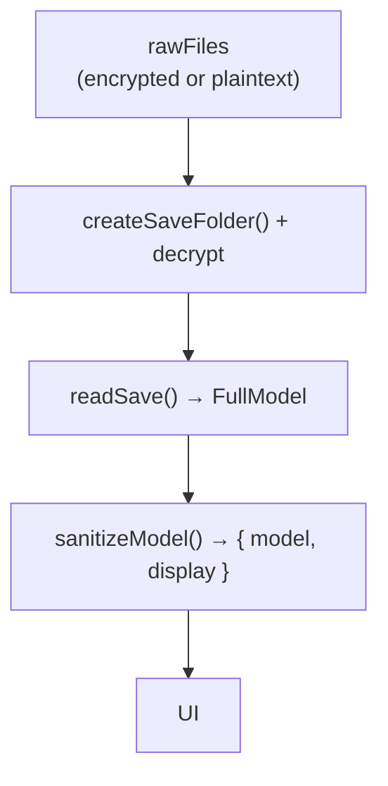
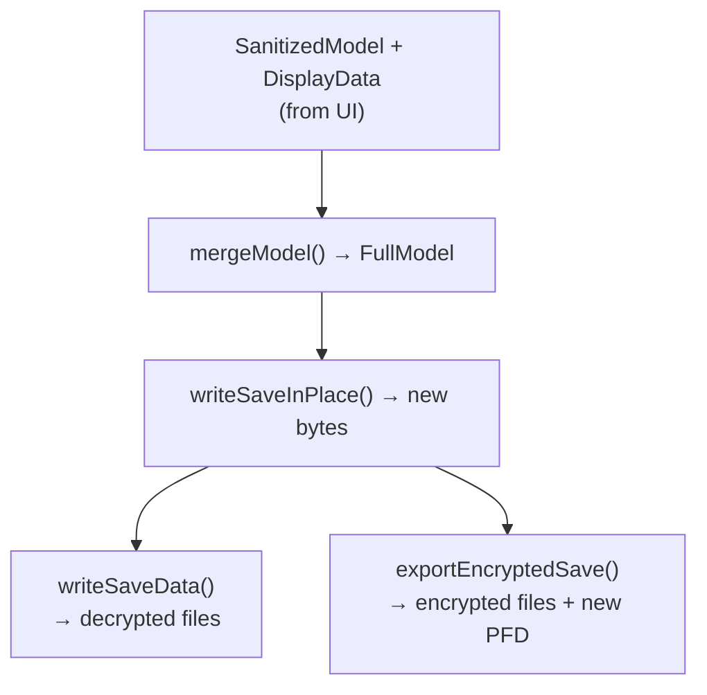
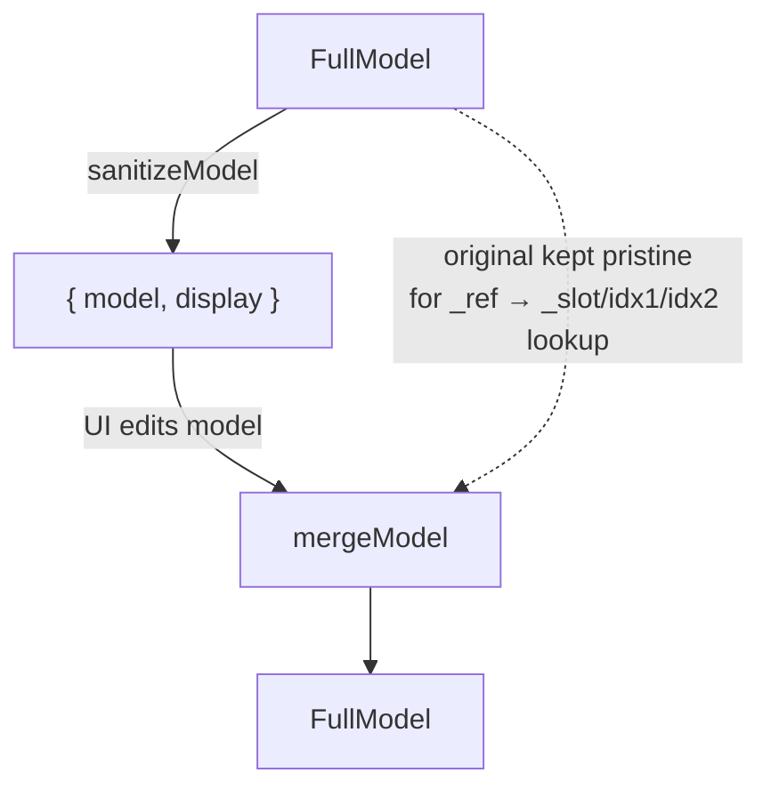

# des-savefile

Binary save file read/write pipeline for **Demon's Souls** `USER.DAT`. Handles the complete
lifecycle: decrypt → parse → sanitize → edit → merge → serialize → encrypt. Supports both
encrypted (real PS3) and unencrypted (RPCS3) saves across all 4 character slots.

## Architecture — Data Flow

### Open (read)



### Write (save / export)



## File Map

| File | Role | Key exports |
|---|---|---|
| `save-api.js` | **Gateway API** — the only module the UI imports | `openSave`, `writeSaveData`, `exportEncryptedSave`, `updateSessionAfterWrite`, `getLimits` |
| `reader.js` | Binary parser — bytes → `FullModel` | `readSave` |
| `writer.js` | Serializer — `FullModel` → bytes | `writeSave`, `writeSaveInPlace`, `writeSecondaryFileInPlace` |
| `model.js` | Sanitize/merge — `FullModel` ↔ `{ model, display }` | `sanitizeModel`, `mergeModel` |
| `offsets.js` | All hardcoded byte offset constants | Named constants (no functions) |

## Public Interface (`save-api.js`)

This is the **only** module the UI layer imports. It hides all crypto, PFD, file resolution,
and model sanitization/merge complexity behind a small set of async functions.

### `openSave(rawFiles, onProgress?)`

Decrypt and parse **all 4 character slots**, returning sanitized models ready for the UI.

```js
const { slots, failedSlots, profileNumber, encrypted } = await openSave(rawFiles);
```

| Return field | Type | Description |
|---|---|---|
| `slots` | `Array<{ slot, session, model, display }>` | Successfully loaded slots (1–4) |
| `failedSlots` | `Array<{ slot, error, primaryFile }>` | Slots that couldn't load (corrupt/unparseable) |
| `profileNumber` | `number` | SFO profile number byte |
| `encrypted` | `boolean` | Whether the source save is encrypted |

Each slot's `session` is an **opaque object** — the UI passes it back to `writeSaveData` /
`exportEncryptedSave` without inspecting it. It contains: `manager`, `fullModel`,
`primaryFile`, `secondaryFile`, `saveSlot`, `sfoBytes`, `rawFiles`, `encrypted`,
`decryptedBytes`.

Each slot's `model` is a `SanitizedModel` and `display` is a `DisplayData` object —
see [Model Types & Sanitization](#model-types--sanitization-modeljs) below.

### `writeSaveData(slots, failedSlots?, profileNumber, onProgress?, inPlace?)`

Write edited models back as **decrypted** files. Produces unencrypted output regardless of
the original encryption state.

```js
const { filesToWrite, encrypted, filesToDelete } = await writeSaveData(
  slots, failedSlots, profileNumber, onProgress
);
```

| Return field | Type | Description |
|---|---|---|
| `filesToWrite` | `Map<string, Uint8Array>` | Filename → bytes to write to disk |
| `encrypted` | `boolean` | Always `false` (output is decrypted) |
| `filesToDelete` | `Set<string>` | Contains `'PARAM.PFD'` if source was encrypted |

**Failed slots** are preserved unchanged — their primary files are decrypted and included
as-is so no data is lost.

**In-place mode** (`inPlace = true`): PARAM.SFO is intentionally NOT written to disk to
avoid encryption-state ambiguity. Profile number and account ID changes are applied to the
in-memory `session.sfoBytes` and take effect on the next non-in-place write (Save As /
Export). See `knowledge/encrypted_export.md`.

### `exportEncryptedSave(slots, failedSlots?, profileNumber, onProgress?, inPlace?)`

Export a fully **encrypted** PS3-compatible save with a new `PARAM.PFD`, copy-protection
removed, and all files re-encrypted. Works from either encrypted or unencrypted sources.

```js
const { filesToWrite, encrypted } = await exportEncryptedSave(
  slots, failedSlots, profileNumber, onProgress
);
```

| Return field | Type | Description |
|---|---|---|
| `filesToWrite` | `Map<string, Uint8Array>` | Includes `PARAM.SFO`, `PARAM.PFD`, encrypted `*.DAT` |
| `encrypted` | `boolean` | Always `true` |

### `updateSessionAfterWrite(slots, filesToWrite, encrypted)`

**⚠️ Destructive operation.** Syncs in-memory session state after an in-place overwrite.
Must be called when the on-disk encryption state changes (e.g. encrypted → decrypted), so
subsequent saves use the current on-disk data instead of stale snapshots.

This function mutates the `rawFiles` map entries **in place** — it replaces `.bytes`
references on existing `rawFiles` entries and may add new entries. If the UI layer holds
references to the original bytes (e.g. for undo/redo), those references are silently
invalidated after this call. Re-open the save from disk (`openSave`) if you need a fresh,
authoritative snapshot.

```js
await updateSessionAfterWrite(slots, filesToWrite, /* encrypted */ false);
```

- For **encrypted** writes: parses the new `PARAM.PFD`, updates `manager.pfd`.
- For **decrypted** writes: clears `manager.pfd` (PFD was deleted), removes it from file maps.
- Syncs `session.sfoBytes` to the just-written PARAM.SFO (copy-on-write in
  `writeSaveData`/`exportEncryptedSave` leaves the original session reference stale).

### `getLimits()`

Returns structural limits the UI may need:

```js
const { depositMaxEntries } = getLimits();  // 2048
```

### `slotExists(rawFiles, saveSlot)` / `resolveSaveFiles(rawFiles, saveSlot)`

File-resolution helpers for determining which `USER.DAT` variant is the active save for a
given slot. See [Multi-Slot & File Naming](#multi-slot--file-naming).

## Model Types & Sanitization (`model.js`)

The module uses a **structural separation** pattern — `sanitizeModel()` returns a pair
`{ model, display }` that cleanly separates editable data from display-only data. This
ensures the writer can never accidentally read display-only data.

### `FullModel` (internal)

Produced by `reader.readSave()`. Contains all binary-internal fields:

| Field group | Examples |
|---|---|
| **Stats & vitals** | `vit`, `str`, `currHP`, `maxMP`, `souls`, `soulMem`, ... |
| **Equipment** | `leftHand1`, `helmet`, `ring1`, `quickSlot1`, `hairstyle`, ... |
| **Equipment pointers** | `leftHand1Ptr`, `helmetPtr`, `quickSlot1Ptr`, ... (17 hotbar inventory-index pointers) |
| **Inventory** | `weapons[]`, `armor[]`, `rings[]`, `goods[]` — each item has `_slot`, `idx1`, `idx2` |
| **Deposit** | `deposit[]` — each item has `unknown1`, `sortOrder`, `flags` |
| **Spells** | `spells[]` — `{ itemId, status, misc1, misc2 }` |
| **Tendency** | `charTendency`, `nexusTendency`, `w1Tendency`–`w5Tendency` |
| **NPC flags** | `sageFreke`, `thomas`, `boldwin` — `{ friendly, hostile, dead }` objects |
| **Identity** | `name`, `gender`, `startClass`, `phantomType` |

Inventory items carry three binary-internal fields:

| Field | Meaning |
|---|---|
| `_slot` | Physical position in the save's inventory array (not stored on disk — runtime only) |
| `idx1` | On-disk index into the parallel durability table and the key used by equipped-slot hotbar pointers |
| `idx2` | On-disk display/sort order index (mirrors `idx1` in observed saves) |

### `SanitizedModel` (UI-facing)

Produced by `sanitizeModel(fullModel).model`. The UI never sees binary internals:

| Category | What changes |
|---|---|
| **Inventory items** | `_slot`, `idx1`, `idx2` are all stripped and replaced by a single opaque `_ref` token (`"inv:42"`). Only editable fields are carried through: `itemId`, `count`, `misc1`, `misc2`, `durability`. |
| **Deposit items** | Binary fields (`unknown1`/`sortOrder`/`flags`) carried as **hidden data** — the UI stores them in DOM `dataset` attributes and passes them through verbatim. New items get defaults on merge. |
| **Spells** | No binary internals — passed through as-is (shallow-copied). |
| **NPC flags** | Deep-copied so UI mutations don't corrupt the original `fullModel` (which must remain pristine for merge). |
| **Everything else** | Already UI-safe (stats, equipment, tendency). Shallow-copied. |

`accountId` and `profileNumber` are folder-level PARAM.SFO fields — they are NOT part of any slot model (`FullModel` or `SanitizedModel`). They are returned separately by `openSave()` and passed as standalone parameters to `writeSaveData()` / `exportEncryptedSave()`.

### `DisplayData` (display-only)

Produced by `sanitizeModel(fullModel).display`. This data is for UI rendering
only and **never flows back** through `collectForm()` → `mergeModel()` → `writeSave()`:

| Field | Type | Purpose |
|---|---|---|
| `equipmentPointers` | `Object<string, number>` | Maps equipment slot names (`leftHand1`, `rightHand1`, … `quickSlot5`) to their hotbar pointer values (`idx1` bindings) from the original save. The UI stores these as `data-roIdx1` on equipment `<span>` elements. |
| `invIdxByRef` | `Map<string, number>` | Maps inventory `_ref` tokens (e.g. `"inv:42"`) to their `idx1` values. Used by the UI for deterministic equipment-inventory binding when duplicate items exist. |

This structural separation ensures the writer can never accidentally read display-only
data — it only receives the `model` half. The writer resolves pointers from the binary
buffer at save time, never from model or display data.

### The Sanitize → Merge Round-Trip



`mergeModel(originalFullModel, sanitizedModel, out?)` reconstructs the full model from the
sanitized (UI) model and the original pristine full model:

- **Existing items**: `_slot`, `idx1`, and `idx2` are restored from the original full model
  via `_ref` lookup. The original full model stays pristine throughout the editing session,
  so these binary-internal fields are authoritative and cannot be corrupted by UI
  modifications.
- **Deleted items** (present in original, absent in sanitized) are detected and their slot
  numbers returned via `out.deletedSlots` — passed to `writeSave()` for surgical clearing.
- **New items** (no `_ref`) leave `_slot`, `idx1`, and `idx2` undefined — the writer assigns
  `_slot` (first available empty slot) and computes `idx1`/`idx2` (set equal to the slot
  number, matching the game's invariant).

## Binary Format Internals

### Buffer Guard

`USER.DAT` must be ≥ 139 KB (`MIN_SAVE_SIZE = 0x22000` — covers the full position table at `POS_TABLE_BASE = 0x21AE3`). Both reader and writer enforce this.
The reader also performs early **encrypted/corrupt data detection**: if `invCount > 2048` or
`spellCount > 512`, it throws before heavy parsing begins.

### Data Regions (`offsets.js`)

| Region | Offset | Layout |
|---|---|---|
| **World / position** | `0x04`–`0x05` | World byte, block byte; position via spawn table (`0x21AE1`) |
| **Vitals** | `0x50`–`0x74` | HP / MP / Stamina — each has current + buffed-max + base-max (Int32BE) |
| **Stats** | `0x7C`–`0xCC` | VIT/INT/END/STR/DEX/MAGIC/FAITH/LUCK — each written **twice** (base + effective) |
| **Identity** | `0xD3`–`0xFB` | Phantom type, name (UTF-16LE pairs), gender, start class |
| **Equipped slots** | `0x238`–`0x2D0` | 18 item IDs + 17 hotbar pointers (UInt32BE) |
| **Inventory** | `0x2D4`–`0x10360` | Count + 2048 slots × 32-byte stride |
| **Durability table** | `0x10364` | Parallel to inventory — indexed by `idx1 * 8` |
| **Spells** | `0x143EC` | Count + N records × 16-byte stride |
| **Deposit** | `0x14BE8` | 2048 entries × 20-byte stride + count at `0x1EBEC` |
| **Tendency** | `0x1EBF0`–`0x1EC1C` | Character + Nexus + 5 worlds — each written **twice** (mirror offsets) |
| **NPC flags** | `0x1FD55`–`0x1FD81` | Sage Freke, Thomas, Boldwin — bit-mask read-modify-write |

### Inventory Record (32 bytes)

```
+0x00  Type      UInt32  0x00000000=weapon, 0x10000000=armor, 0x20000000=ring, 0x40000000=goods
+0x04  ItemID    UInt32  game item ID
+0x08  Count     UInt32  stack count
+0x0C  Idx1      UInt32  durability table key + hotbar pointer reference (validated as U16)
+0x10  Misc1     UInt16  "sortId" — inventory menu grouping/ordering
+0x12  Idx2      UInt16  display/sort order index
+0x14  Misc2     UInt32  unknown (preserved verbatim, usually 0x01000000)
```

Durability is stored in a **parallel table** at `0x10364 + Idx1 * 8`, not within the record.

### Deposit Entry (20 bytes)

```
+0x00  unknown1    UInt32  usually 0x00000000
+0x04  type        UInt8   0x00=weapon, 0x10=armor, 0x20=ring, 0x40=goods, 0xFF=empty
+0x05  itemId      UInt24  3-byte big-endian item ID
+0x08  sortOrder   UInt32  hi16=sortId, lo16=deposit order index
+0x0C  count       UInt8   stack count
+0x0D  flag        UInt8   0x21 for items, 0x00 for empty
+0x0E  pad         UInt32  0x00000000 for items; 0x0000FFFF for empty
+0x12  durability  UInt16  weapon/armor max durability
```

## Writer Internals (`writer.js`)

`writeSave()` is a thin cloning wrapper around `writeSaveInPlace()`. It clones the input
buffer, writes to the clone, and returns it. The caller's original buffer is never mutated.

`writeSaveInPlace()` mutates the buffer directly and is used internally by
`decryptAndMergeSlots` in `save-api.js` to avoid the unnecessary ~512 KB allocation + copy
on the internal hot path.

### Deterministic Pointer Resolution

When equipment is changed, the writer resolves hotbar pointers (which inventory `idx1` an
equipped slot points to) using this priority:

0. **ID unchanged** → keep the existing pointer verbatim (backward-compat for no-op re-saves
   and the common case where equipment hasn't changed).
1. **Current pointer already correct** → if the on-disk pointer's `idx1` maps to an inventory
   row whose `itemId == newId`, keep it (handles ID/pointer desync).
2. **First-wins fallback** → pick the first inventory row matching `newId`. This rule fires
   for genuine swaps where the equipped item is changed to something new.

Empty slots (`0xFFFFFFFF`) clear their pointer. Foreign IDs (not in inventory) leave the
pointer untouched.

Pointer resolution reads from the binary buffer only — never from display-only model data.

### Surgical Inventory Management

Instead of blank-and-rewrite, the writer does surgical updates:

1. **Update** existing items at their original `_slot` positions.
2. **Clear** deleted slots (from `mergeModel`'s `out.deletedSlots`) by writing a full 32-byte
   `0xFF` template — including zeroing the corresponding durability table entry.
3. **Assign idx1/idx2** for new items: `idx1 = idx2 = slot_number` (the game's invariant —
   every item uses its physical slot position as its idx1).
4. **Add** new items into the first available empty slot (forward-only scan — O(INV_SLOTS)
   total regardless of how many items are added).
5. **Update** `INV_COUNT` and `INV_COUNT_MIRROR` to the new total.

### Deposit Wipe-and-Rebuild

The deposit is handled differently from inventory — the writer blanks all 2048 slots, then
writes items sequentially from the model. This matches the game-native format.

### Range Validation

All integer fields are range-checked before writing:

- `assertU8` — [0, 255], rejects non-integers
- `assertU16` — [0, 65535], rejects non-integers
- `assertU32` — [0, 4294967295], rejects non-integers

The `val()` helper uses `Number()` (not `parseFloat()`) for strict parsing — malformed
strings like `"12abc"` are rejected rather than silently coerced. Non-integer values (e.g.
`3.5`) are also rejected to prevent silent truncation by bitwise operations.

### Secondary File (`writeSecondaryFileInPlace`)

The shared secondary file (`04USER.DAT`) stores per-slot character names and worlds at
different offsets. `writeSecondaryFileInPlace` **mutates in place** (unlike `writeSave`)
because it's called once per slot on the same shared buffer.

Names are stored as 16 UTF-16LE character pairs (32 bytes) with no length prefix —
unused slots are zero-filled. Byte 0xD4 (just before the data) is zeroed so the
game's UTF-16 read from 0xD4 sees `[0x00, char0]` as the first character pair.

## Multi-Slot & File Naming

Demon's Souls uses a **rotational triple-naming convention** for save files:

```
Slot 1:  USER.DAT → 1USER.DAT → 2USER.DAT     (rotation: A → B → C → A)
Slot N:  0(N-1)USER.DAT → 10(N-1)USER.DAT → 20(N-1)USER.DAT
Shared:  04USER.DAT → 104USER.DAT → 204USER.DAT
```

The game designates the **active file by the absence of its successor** in the rotation.
If `B` is missing, `A` is active. If `C` is missing, `B` is active. This handles the case
where a deleted character leaves a stale zeroed-out file on disk.

`resolveRotational()` implements this logic. `resolveSaveFiles()` resolves both the primary
and secondary filenames for a given slot.

**Fallback limitation**: if all three rotation variants exist (no missing successor), the
fallback picks the first one found. A stale zeroed-out file would be selected here — but
downstream validation (`readSave`'s `SANITY_CHECK` at offset `0x170`) catches zeroed files
and routes the slot to `failedSlots`, so no data corruption results.

## Performance Notes

### Sequential Crypto on the Main Thread

Crypto operations (decrypt/encrypt) run sequentially on the main thread with `setTimeout(0)`
yields between jobs to prevent UI freeze. **Web Workers were evaluated and rejected** as
over-engineering: the added complexity (separate bundle build step, message-passing
overhead) saved less than 100ms for the typical 4-slot save (8 files × ~50-100ms each). The
sequential approach is simpler, has no serialization overhead, and the `setTimeout` yields
keep the UI responsive enough for the use case.

## Dependencies

| Dependency | Usage |
|---|---|
| [`ps3-save-lib`](../lib/ps3-save-lib/) | Decrypt/encrypt, PFD creation/hashing, SFO parsing, endian read/write helpers |
| [`des-db`](../des-db/) | Not directly imported — the UI layer bridges save data with game database lookups |

The hardcoded **Secure File ID** for Demon's Souls is `0123456789ABCDEFFEDCBA9876543210`.