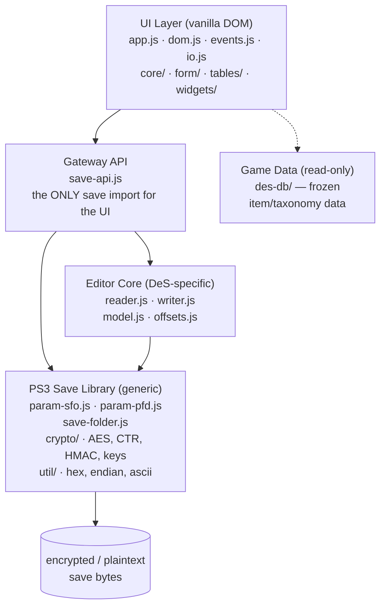
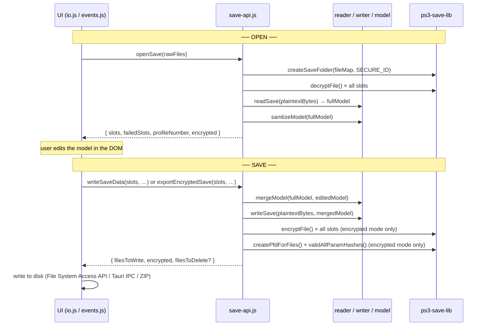

# DemonSave-PS3 — Overview

## 1. What is DemonSave-PS3?

DemonSave-PS3 is a **browser-based save editor for Demon's Souls (PS3)**.
It reads a PS3 save folder, decrypts and parses the binary `USER.DAT`
game data into an editable form, lets the user modify characters,
inventory, equipment, spells, and deposit, then re-serializes,
re-encrypts, and writes the folder back out — all entirely in the
browser or as a native desktop app via Tauri.

**Purpose.** The PS3 save is a binary blob protected by two layers of
encryption and an integrity hash chain. Editing it by hand is
impractical, and existing native tools assume you run Windows. This
project makes the whole pipeline — decrypt, parse, edit, re-encrypt,
rehash — work from a single static web page with no server and no
native dependencies. It also supports seamless conversion between
encrypted (real PS3) and unencrypted (RPCS3) formats.

**Scope.** The editor targets Demon's Souls specifically (not the PS5
remake). It handles every character slot (1–4), the shared world-state
file, PARAM.SFO metadata, and PARAM.PFD integrity — with full
encrypted↔decrypted mode transitions in either direction.

---

## 2. A PS3 Save, Briefly

A real PS3 Demon's Souls save is a **folder**, not a single file:

| File | Role |
|---|---|
| `PARAM.SFO` | Metadata: title, profile number, `ACCOUNT_ID` (PSN binding), copy-protection flag |
| `PARAM.PFD` | Integrity envelope: hash table, per-file encryption keys, signature chain |
| `USER.DAT`, `1USER.DAT`, … | Character-slot save data (encrypted), up to 4 slots |
| `04USER.DAT` | Shared world/portal state (encrypted) |
| `ICON0.PNG`, `PIC1.PNG` | Save icon and background (plain assets) |

Two independent protection layers must be satisfied for a save to load
on real hardware:

1. **File-level encryption** — each `USER.DAT` is encrypted with a
   custom CTR-like transform built on AES-128-ECB. The per-file key is
   derived from the entry's hash seed in the PARAM.PFD and the game's
   hardcoded SecureFileID.
2. **PARAM.PFD integrity** — a hash chain (HMAC-SHA1 keyed hashes,
   AES-CBC-encrypted entry keys, and a signed header) seals the entire
   folder. Tamper with any protected byte and the PS3 rejects the save.

`PARAM.SFO` itself is **never encrypted**, but it *is* hashed (slot 0)
and is the only file that carries account-binding data.

**Encrypted vs. unencrypted.** RPCS3 saves omit `PARAM.PFD` and store
`USER.DAT` files as plaintext. The editor detects which mode a folder is
in on open and can convert in either direction on save/export.

---

## 3. Architecture Overview

The project is organized as a set of clean layers. Each layer only
imports from the one below it, and the UI talks to exactly one module —
the Gateway API.



The arrows show dependency direction. The UI layer imports **only**
`save-api.js` from the save pipeline — it never touches the reader, writer,
PFD/SFO, or crypto modules directly. `des-db` is a **side data source**:
only the UI reads from it (for populating dropdowns and resolving item
names), but it has no knowledge of the save pipeline — it is pure reference
data. The editor core (`des-savefile`) does **not** import `des-db` at all.
The `EDITOR --> PS3` arrow is a lightweight utility dependency — the
reader/writer import endian helpers from the PS3 Save Library, but this
does not participate in the decrypt/encrypt pipeline.

---

## 4. The Gateway API

`js/des-savefile/save-api.js` is the **only** save-pipeline module the
UI imports. All complexity — decrypt/encrypt, PFD rebuild, multi-slot
file resolution, model sanitization, backup-file handling — is hidden
behind a small set of functions.

### Exports

| Function | Purpose |
|---|---|
| `openSave(rawFiles, onProgress)` | Decrypt + parse **all** character slots → `{ slots, failedSlots, profileNumber, encrypted }` |
| `writeSaveData(slots, failedSlots, profileNumber, onProgress, inPlace?)` | Merge + write all slots as **decrypted** files → `{ filesToWrite, encrypted, filesToDelete }` |
| `exportEncryptedSave(slots, failedSlots, profileNumber, onProgress, inPlace?)` | Merge + write all slots as a **fully encrypted** PS3 save → `{ filesToWrite, encrypted }` |
| `reloadSlotModels(slots, onProgress)` | Re-sanitize models after a save so new items get stable `_ref` tokens |
| `updateSessionAfterWrite(slots, filesToWrite, encrypted)` | Sync in-memory session state after an in-place overwrite |
| `resolveSaveFiles(files, saveSlot)` | Resolve primary/secondary `USER.DAT` filenames for a slot |
| `slotExists(files, saveSlot)` | Check whether a slot is present in the folder |
| `getLimits()` | Re-exported structural limit (`depositMaxEntries`) |

### The `session` object (opaque to the UI)

Each entry in `slots` carries a `session` object the UI passes through
untouched. It holds everything needed to write the slot back:

```javascript
{
  manager,          // save-folder context (PFD, file map, encrypted flag)
  fullModel,        // original parsed model (with binary internals)
  primaryFile,      // resolved primary filename, e.g. "USER.DAT"
  secondaryFile,    // resolved shared file, e.g. "04USER.DAT"
  saveSlot,         // 1-based slot number
  sfoBytes,         // mutable PARAM.SFO bytes (profile/account patched on save)
  rawFiles,         // original file map from the UI
  encrypted,        // boolean — was the source folder encrypted?
  decryptedBytes,   // cached plaintext from openSave (avoids re-decrypt on save)
}
```

### Multi-slot + failed-slot preservation

The editor loads every slot (1–4) at once. Slots that fail to decrypt or
parse are collected into `failedSlots` and **preserved unchanged** on
write — their primary files are decrypted and re-written verbatim so the
user never loses data from a partially corrupt save.

### Save-slot filename resolution

Demon's Souls uses a circular triple-naming convention per slot
(`USER.DAT → 1USER.DAT → 2USER.DAT → USER.DAT`). The game designates the
active file by the **absence of its successor** in the rotation.
`resolveRotational()` implements this so the editor picks the correct
active file even when a deleted character leaves a zeroed-out stale file
behind.

---

## 5. The Save Pipeline

The round-trip has two halves. **Open** turns bytes on disk into an
editable model; **Save** turns the edited model back into bytes.



**Performance note.** `openSave` caches each slot's decrypted plaintext
in `session.decryptedBytes`. On save, `mergeModel` reuses that cache
instead of re-running AES-CBC decryption — the single biggest win for
encrypted-save round-trips.

---

## 6. Model Sanitization & `_ref` Tokens

### The problem

The "full model" produced by `reader.js` contains binary-internal fields
needed for write-back fidelity but that must never be exposed to or
edited by the UI:

| Field | Where | Why it's sensitive |
|---|---|---|
| `_slot` | Inventory records | Physical slot position — must be preserved for in-place writes |
| `idx1` | Inventory records | Durability-table key + hotbar pointer reference |
| `idx2` | Inventory records | Display/sort order index |
| `misc2` | Inventory records | Unknown (always `0x01000000`) — preserved verbatim |
| `unknown1`/`sortOrder`/`flags[0..6]` | Deposit records | Unknown, sort-order, and flag/durability bytes carried for fidelity |

### The solution: two strategies

`sanitizeModel()` uses **different strategies** for inventory and
deposit binary internals:

- **Inventory** → binary fields (`_slot`, `idx1`, `idx2`) are stripped
  and replaced by an opaque `_ref: "inv:<slot>"` token (e.g.
  `"inv:42"`). The UI treats `_ref` as a black box, carrying it through
  the DOM via `data-ref` attributes. On save, `mergeModel()` maps each
  token back to the original binary fields.
- **Deposit** → no `_ref` tokens. Binary fields (`unknown1`,
  `sortOrder`, `flags`) are carried through as **hidden data** — the UI
  stores them in DOM `dataset` attributes and passes them through
  verbatim on save. New items that lack these fields get structural
  defaults during merge.

This guarantees write-critical state can never be accidentally modified
from the UI.

### UI-facing model shapes

`sanitizeModel()` returns a **pair** — `{ model, display }` — that
structurally separates editable data from display-only data:

```javascript
// Inventory (weapons, armor, rings, goods)
{ _ref, itemId, count, misc1, misc2, durability }

// Deposit (Thomas storage) — binary fields carried as hidden data
{ category, itemId, count, durability, unknown1, sortOrder, flags }

// Spells / miracles
{ itemId, status, misc1, misc2 }
```

The `display` half carries read-only data for UI rendering that never
flows back through the writer:

| Field | Purpose |
|---|---|
| `equipmentPointers` | Maps equipment slot names → hotbar pointer values (`idx1` bindings) from the original save |
| `invIdxByRef` | Maps inventory `_ref` tokens → `idx1` values, for deterministic equipment-inventory binding |

### New items (no `_ref` match)

When the user adds an item with no corresponding original record,
`mergeModel()` assigns safe defaults:

| Category | Field | Default |
|---|---|---|
| Inventory | `_slot` | `undefined` — writer finds the next free slot |
| Inventory | `idx1` / `idx2` | Set to the slot number by the writer (the game's invariant) |
| Deposit | `unknown1` | `0` |
| Deposit | `sortOrder` | `0` (item appears at top of deposit list instead of natural category position) |
| Deposit | `flags[0]` (flag byte) | `0x21` (game-native "occupied" marker) |
| Deposit | `flags[5..6]` (durability bytes) | `0` — writer takes durability from the named `durability` field |

---

## 7. Game Data Module (`des-db`)

`js/des-db/` is the **read-only source of truth for all game knowledge**:
item names, IDs, the full type/sub-type taxonomy, upgrade paths, base
weapons, spells, classes, and warp coordinates. It is consumed solely by
the UI layer (combo-box population, name display, durability lookup,
upgrade-path resolution). The save-pipeline modules never import it —
the editor operates on raw item IDs and is entirely game-data-agnostic.

Key properties:

- **Immutable** — all exported data is deep-frozen at load; mutation
  throws in strict mode.
- **Fail-fast** — unknown categories, IDs, or upgrade refs throw
  immediately rather than returning `undefined`.
- **Zero per-call allocation** — ordered arrays and lookup maps are
  built once at load and returned directly.
- **Generated reverse index** — `idx-upgrade-ref.js` enables O(1)
  resolution from an `upgrade_ref` triple back to a weapon's hex ID.
  A stale-index guard compares its entry count against `weapons.js` at
  load time and throws on mismatch. Regenerate it with
  `npm run gen:db-index`.

The module covers six item categories — **weapons** (which bundles
shields, bows, ammo, armor, and casting tools under one roof), **armor**,
**rings**, **goods**, **spells**, and **hairstyles** — plus a 13-entry
type taxonomy, 14 upgrade paths, 89 base weapons, 10 starting classes,
and 32 warp locations.

Full schemas, the type table, and the complete public API surface are
documented in `js/des-db/README.md`.

---

## 8. Design Principles

1. **Gateway API pattern.** The UI imports only `save-api.js`. The
   reader, writer, model, PFD/SFO, and crypto modules are never imported
   directly by the front-end. This keeps the boundary between rendering
   and binary I/O strict and testable.

2. **Surgical in-place writes.** The writer never blanks or rewrites the
   inventory region. It patches only the specific fields that changed,
   at each item's original slot position. This avoids the inventory
   reordering corruption the game is known to reject.

3. **`_ref` token indirection.** Binary internals (`_slot`, `idx1`,
   `idx2`, raw deposit flag bytes) are never exposed to the UI. The
   sanitized model uses opaque tokens that `mergeModel()` resolves back
   on save — the DOM cannot corrupt what it cannot see.

4. **Equipped slots & active selectors are left alone.** The writer
   reads and writes the 18 equipped item IDs, but it deliberately does
   not touch the active-hand or active-quick-slot selectors
   (`0x284`, `0x288`, `0x1035C`). Changing those is how the game records
   "which weapon is currently drawn," and rewriting them would desync
   the save from the player's intent.

5. **Immutable, fail-fast game data.** `des-db` is frozen at load and
   throws on unknown lookups. A wrong item ID fails loudly instead of
   silently producing a corrupt save.

6. **Defense-in-depth testing.** Unit tests cover crypto primitives,
   endian helpers, PFD round-trips, and model sanitize/merge logic.
   Integration tests run full save → edit → re-save → re-read round-trips
   on disk, including encrypted↔decrypted transitions and multi-slot
   folders.

---

## 9. Save Mode Transitions

The editor can open either format and save/export as either format. This
makes it a fully bidirectional converter between real-PS3 and RPCS3
saves.

| Action | Input state | Output state | Notes |
|---|---|---|---|
| Save (decrypted mode) | Unencrypted | Unencrypted | Direct write-back |
| Save (decrypted mode) | Encrypted | **Unencrypted** | Decrypts; signals `PARAM.PFD` for deletion |
| Save (encrypted mode) | Unencrypted | Encrypted | Builds a new `PARAM.PFD` from scratch |
| Save (encrypted mode) | Encrypted | Encrypted | Re-encrypts with fresh keys + hashes |
| Export (decrypted) | Any | Unencrypted | Downloads a ZIP of plaintext files |
| Export (encrypted) | Any | Encrypted | Downloads a ZIP with encrypted files + new PFD |

### In-place write: the PARAM.SFO omission

When saving in-place to an existing folder, `PARAM.SFO` is intentionally
**excluded** from the returned `filesToWrite`. The folder may still
contain `PARAM.PFD` at write time (it's queued for deletion via
`filesToDelete`, but removal happens after the write). Writing a patched
SFO while the PFD is still present would make the next `openSave()` treat
the folder as "encrypted" and run decryption on already-decrypted
plaintext — irrecoverable corruption.

Instead, the SFO bytes are patched **in memory** (`session.sfoBytes` is
mutated and kept current via `updateSessionAfterWrite`), and the patched
SFO lands on disk on the next Export (ZIP download). SFO-level changes
(profile number, account ID) applied via in-place Save therefore persist
on the next Export.

### PSN account binding & copy protection

The editor can patch `ACCOUNT_ID` (the 16-byte PSN account field) so an
exported save loads on a different PS3/PSN account without needing
Apollo Save Tool. It can also zero the `ATTRIBUTE` field to remove copy
protection, equivalent to Apollo's `sfo_patch_lock()`.

---

## 10. Browser vs. Desktop (Tauri)

The same web app runs in two contexts:

- **Browser** — uses the File System Access API
  (`showDirectoryPicker`) for in-place open/save on Chromium; falls back
  to drag-and-drop folder loading + ZIP export on Firefox/Safari.
- **Tauri desktop app** — the app detects `window.__TAURI__` and routes
  file I/O through native OS dialogs (via the `rfd` crate) and IPC
  commands defined in `src-tauri/src/lib.rs`. Binary data is
  base64-encoded for IPC transport.

Tauri is purely a **capability layer** — the entire browser feature set
remains intact. The Rust side exists only to provide native file dialogs
and directory handles; all save-parsing logic lives in JavaScript.

---

## 11. Test Structure

Tests are split into unit tests (fast, no disk I/O) and integration
tests (round-trips on real files).

### Commands

| Command | What it runs |
|---|---|
| `npm test` | All unit tests (`tests/**`) |
| `npm run test:savefile` | `tests/des-savefile/` — editor, save API, model |
| `npm run test:ui` | `tests/ui/` — DOM, controls, events |
| `npm run test:ps3-lib` | `tests/lib/ps3-save-lib/` — crypto, endian, PFD, SFO |
| `npm run test:db` | `tests/des-db/` — game data integrity (regenerates index first) |
| `npm run test:integration` | `integration-tests/` — full round-trips on disk |

### What's covered

- **Crypto primitives** — AES, HMAC-SHA1, CTR-like mode
- **Endian & hex helpers** — big-endian binary I/O
- **PARAM.SFO** — `ACCOUNT_ID` read/write, copy-protection removal, profile number round-trip
- **PARAM.PFD** — decrypt/encrypt, full hash-chain rebuild, create-from-scratch
- **Reader/Writer** — idempotency, inventory/deposit/equipment round-trips, range validation
- **Model** — sanitize/merge round-trip, binary-internal field handling
- **Gateway API** — open/write/export, multi-slot resolution, encrypted↔decrypted transitions
- **Type safety** — `tsc --checkJs` with JSDoc annotations (0 type errors, 0 `@ts-nocheck` across all checked modules)
- **Integration** — save → edit → re-save → re-read across multi-slot folders, all fields, realistic data, and every format combination
- **Fuzzing** — coverage-guided fuzzing via Jazzer.js of every untrusted-binary parser (`readSave`, `parseParamPfd`, `parseParamSfo`), the read→write→read round-trip, and the full `openSave` pipeline (see [`howto.md`](howto.md) → Fuzzing). A shared oracle (`fuzz/oracle.js`) enforces that every input either yields a well-formed value or throws a clean domain `Error`. Fuzzing has already surfaced and fixed real missing-guard bugs (non-finite floats in the reader, OOB count/offset reads in the PFD/SFO parsers).

---

## 12. Contributing

Contributions are welcome! Before opening an issue or pull request, read the
[`CONTRIBUTING.md`](CONTRIBUTING.md) guide — it covers the development setup,
code style (Prettier / ESLint / Stylelint / JSDoc `--checkJs`), the test and
fuzz workflow, the generated files to avoid hand-editing, versioning, and the
PR checklist. Note in particular the load-bearing architecture rules in
[§3](#3-architecture-overview) and [§8](#8-design-principles): the UI imports
only `save-api.js`, the editor core never imports `des-db`, and binary
internals stay opaque to the UI.

This project follows the [Contributor Covenant Code of Conduct](CODE_OF_CONDUCT.md).
By participating you agree to uphold it.
