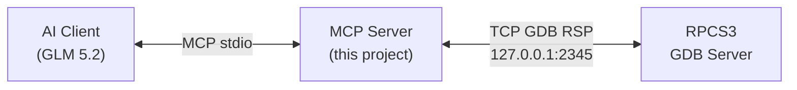

# RPCS3 MCP Server

An MCP (Model Context Protocol) server that provides full control over RPCS3's external debugger via the GDB Remote Serial Protocol. This allows AI assistants (like GLM 5.2) to debug PS3 games running in RPCS3.

## Features

- **Full GDB RSP protocol support** — all 18 GDB commands + interrupt
- **28 MCP tools** covering every debug operation
- **Persistent connection** — connects once, stays connected across tool calls
- **Big-endian aware** — PS3 memory is big-endian, all helpers handle this correctly
- **Register name support** — use `r3`, `pc`, `lr` etc. instead of raw IDs

## Quick Start

### 1. Configure RPCS3

Edit RPCS3's `config.yml`:

```yaml
Miscellaneous:
  GDB Server: "127.0.0.1:2345"

Core:
  PPU Decoder: 0   # Must be Interpreter (0) or Interpreter Fast (1), NOT LLVM (2)
```

### 2. Install Dependencies

```bash
cd rpcs3-mcp-server
npm install
```

### 3. Configure MCP Client

Add to your MCP client configuration (e.g., `.mcp.json`):

```json
{
  "mcpServers": {
    "rpcs3-debugger": {
      "command": "node",
      "args": ["rpcs3-mcp-server/src/index.js"],
      "env": {
        "RPCS3_GDB_HOST": "127.0.0.1",
        "RPCS3_GDB_PORT": "2345"
      }
    }
  }
}
```

### 4. Boot a Game and Debug

1. Launch RPCS3 and boot a game
2. The GDB server starts automatically on `127.0.0.1:2345`
3. Use the `connect` tool to connect
4. Use `dump_state` to see the current state
5. Set breakpoints, step, read/write memory, etc.

## Available Tools (28)

### Connection Management
| Tool | Description |
|------|-------------|
| `connect` | Connect to RPCS3 GDB server |
| `disconnect` | Disconnect from GDB server |

### Status & Info
| Tool | Description |
|------|-------------|
| `get_stop_reason` | Get why the target stopped (`?` command) |
| `query_supported` | Query GDB server features (`qSupported`) |
| `query_attached` | Query attach status (`qAttached`) |

### Thread Management
| Tool | Description |
|------|-------------|
| `list_threads` | List all PPU thread IDs (`qfThreadInfo`) |
| `get_current_thread` | Get current thread ID (`qC`) |
| `set_thread` | Set thread for operations (`H` command) |

### Execution Control
| Tool | Description |
|------|-------------|
| `continue` | Continue execution (`vCont;c`) |
| `step` | Step one instruction / step into (`vCont;s`) |
| `interrupt` | Send Ctrl-C interrupt (`0x03`) |
| `kill` | Kill emulated process (`k`) |
| `query_continue_support` | Query vCont support (`vCont?`) |

### Breakpoints
| Tool | Description |
|------|-------------|
| `set_breakpoint` | Set software breakpoint (`Z0`) |
| `remove_breakpoint` | Remove software breakpoint (`z0`) |

### Register Access
| Tool | Description |
|------|-------------|
| `read_register` | Read single register (`p`) |
| `write_register` | Write single register (`P`) |
| `read_all_registers` | Read all 71 registers (`g`) |
| `read_pc` | Convenience: read Program Counter |

### Memory Access
| Tool | Description |
|------|-------------|
| `read_memory` | Read memory as hex (`m`) |
| `read_memory_ascii` | Read memory as ASCII string |
| `read_memory_u32` | Read 32-bit big-endian integer |
| `read_memory_u64` | Read 64-bit big-endian integer |
| `write_memory` | Write hex data to memory (`M`) |
| `write_memory_u32` | Write 32-bit big-endian value |

### Utilities
| Tool | Description |
|------|-------------|
| `extended_mode` | Extended mode (`!` command) |
| `send_raw_command` | Send any raw GDB command |
| `dump_state` | Snapshot: stop reason + threads + PC + all registers |

## Register Names

PPU (PowerPC 64-bit) registers can be referenced by name:

| Category | Names | GDB IDs |
|----------|-------|---------|
| General Purpose | `r0`–`r31` | 0–31 |
| Floating Point | `f0`–`f31` | 32–63 |
| Program Counter | `pc` or `cia` | 64 |
| Machine State Reg | `msr` | 65 |
| Condition Register | `cr` | 66 |
| Link Register | `lr` | 67 |
| Count Register | `ctr` | 68 |
| XER | `xer` | 69 |
| FPSCR | `fpscr` | 70 |

## Environment Variables

| Variable | Default | Description |
|----------|---------|-------------|
| `RPCS3_GDB_HOST` | `127.0.0.1` | Default GDB server host |
| `RPCS3_GDB_PORT` | `2345` | Default GDB server port |

## How It Works



The MCP server:
1. Receives tool calls from the AI client via stdio (MCP protocol)
2. Translates them to GDB Remote Serial Protocol packets (`$cmd#checksum`)
3. Sends them over TCP to RPCS3's built-in GDB server
4. Returns responses back to the AI client

## File Structure

```
rpcs3-mcp-server/
├── package.json          # Node.js project config
├── src/
│   ├── index.js          # MCP server with 28 tools
│   └── gdb-client.js     # GDB RSP protocol client library
└── README.md             # This file
```

## Debugging Tips

- **Breakpoints require Interpreter mode** — set PPU Decoder to Interpreter or Interpreter Fast in RPCS3 config. LLVM JIT mode disables breakpoints.
- **All-stop mode** — when any thread hits a breakpoint, all threads pause
- **Step Over/Out** — not natively supported; the AI client can simulate by setting temporary breakpoints at the return/next address, then continuing
- **Use `dump_state`** for a quick snapshot of the current execution state
- **Memory is big-endian** — PS3's Cell processor is big-endian; all u32/u64 helpers handle this

## Example: Debug Session

```
1. connect → "connected to 127.0.0.1:2345"
2. dump_state → see current PC, registers, threads
3. set_breakpoint address="0x00a3b4c0" → "breakpoint_set"
4. continue → "stopped, signal: SIGTRAP" (hit breakpoint)
5. read_register register="r3" → "0x0000000000001234"
6. step → "stopped, signal: SIGTRAP" (stepped one instruction)
7. read_pc → "0x00a3b4c4"
8. read_memory address="0x10000000" length="16" → hex bytes
9. remove_breakpoint address="0x00a3b4c0"
10. disconnect